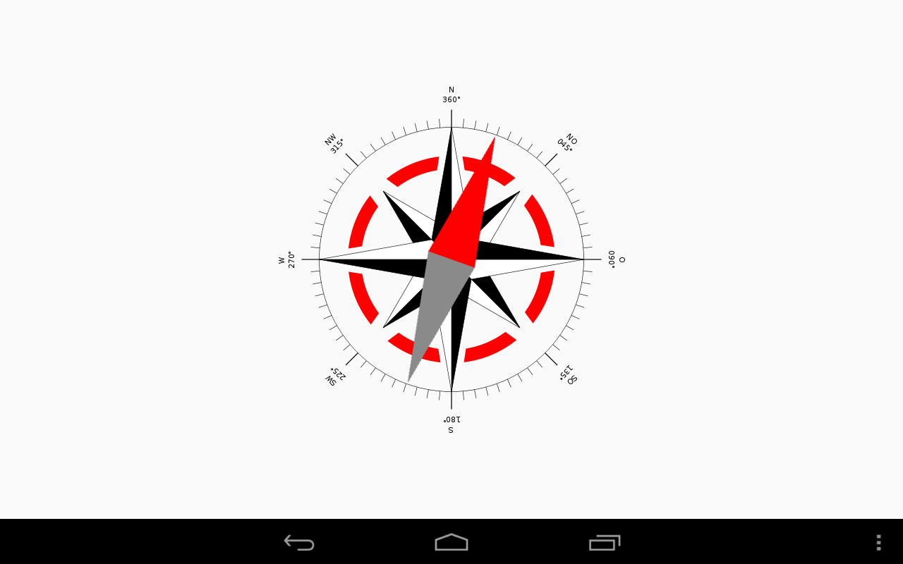

Compass
-------

The following example is an extract from the Compass app as provided in the Kivy
`examples/android/compass <https://github.com/kivy/kivy/tree/master/examples/android/compass/>`__
folder:

.. code-block:: python

    # ... imports
    Hardware = autoclass('org.renpy.android.Hardware')

    class CompassApp(App):

        needle_angle = NumericProperty(0)

        def build(self):
            self._anim = None
            Hardware.magneticFieldSensorEnable(True)
            Clock.schedule_interval(self.update_compass, 1 / 10.)

        def update_compass(self, *args):
            # read the magnetic sensor from the Hardware class
            (x, y, z) = Hardware.magneticFieldSensorReading()

            # calculate the angle
            needle_angle = Vector(x , y).angle((0, 1)) + 90.

            # animate the needle
            if self._anim:
                self._anim.stop(self)
            self._anim = Animation(needle_angle=needle_angle, d=.2, t='out_quad')
            self._anim.start(self)

        def on_pause(self):
            # when you are going on pause, don't forget to stop the sensor
            Hardware.magneticFieldSensorEnable(False)
            return True

        def on_resume(self):
            # reactivate the sensor when you are back to the app
            Hardware.magneticFieldSensorEnable(True)

    if __name__ == '__main__':
        CompassApp().run()

If you compile this app, you will get an APK which outputs the following
screen:

   Screenshot of the Kivy Compass App
   (Source of the Compass Windrose: `Wikipedia <http://en.wikipedia.org/wiki/Compass_rose>`__)

