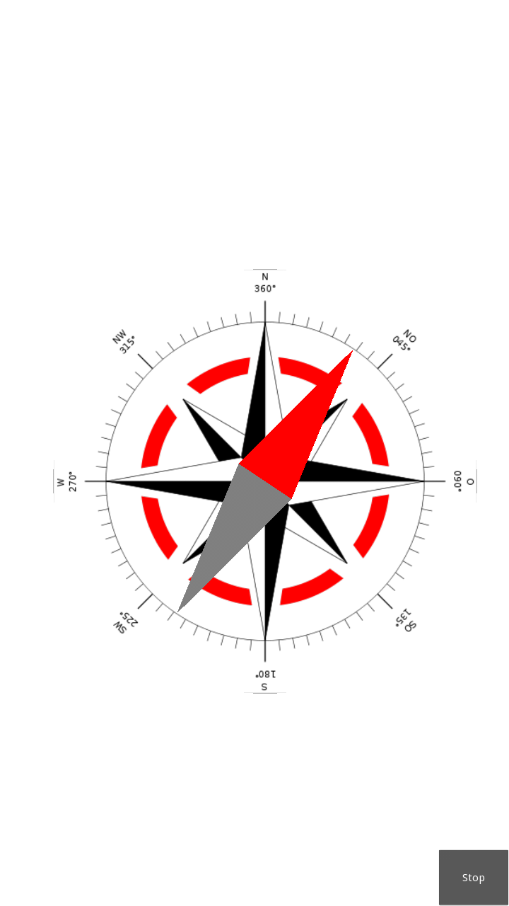

Android Python module
=====================

Python for android project include a python module named "android". This module is designed to give you an access to the Java Android API. 
As for today, the module is very limited, and waiting for contribution to wrap more Java Android API.

How to use it
-------------

Using `PyJNIus <https://github.com/kivy/pyjnius>`__ to access the Android API 
restricts the usage to a simple call of the **autoclass** constructor function
and a second call to instantiate this class.

You can access through this method all Java Android API, e.g. to get the DisplayMetrics
of an Android device could fetched using the following piece of code:

.. code-block:: python

   DisplayMetrics = autoclass('android.util.DisplayMetrics')
   metrics = DisplayMetrics()
   metrics.setToDefaults()
   self.densityDpi = metrics.densityDpi

You can access all fields and methods as described in the `Java Android
DisplayMetrics API <http://developer.android.com/reference/android/util/DisplayMetrics.html>`__
as shown here with the method `setToDefaults()` and the field `densityDpi`.
Before you use o view a field, you should always call `setToDefaults` to initiate
to the default values of the device.

Currently only JavaMethod, JavaStaticMethod, JavaField, JavaStaticField
and JavaMultipleMethod are built into PyJNIus, therefore such constructs like
registerListener or something like this have to be coded still in Java. 
For this the Android module described below is available to access some of 
the hardware in Android devices.

More background how to use the Java Android API without PyJNIus is also given
below in the chapter `how-it-s-working-without-pyjnius`_

Prebuilt VirtualBox
-------------------

A good starting point to build an APK are prebuilt VirtualBox images, where
the Android NDK, the Android SDK and the Kivy Python-For-Android sources 
are prebuilt in an VirtualBox image. Please search the `Download Section 
<http://kivy.org/#download>`__ for
such an image.

Example
-------

The following example is an extract from the Compass app as provided in the Kivy
`examples/android/compass <https://github.com/kivy/kivy/tree/master/examples/android/compass/>`__
folder:

.. code-block:: python

   from jnius import autoclass

   ... 

   class CompassApp(App):

       def __init__(self, **kwargs):
           """
           Constructor of the Compass App

           1) The Java Android API DisplayMetrics is called to get
           information about the densityDpi factor of the Android device

           2) The Kivy Python-For-Android Android API is called to
           get access to the hardware sensors of the Android device

           """
           super(CompassApp, self).__init__(**kwargs)
           DisplayMetrics = autoclass('android.util.DisplayMetrics')
           metrics = DisplayMetrics()
           metrics.setToDefaults()
           LoggerDisplayMetrics(metrics)
           self.densityDpi = metrics.densityDpi

           Hardware = autoclass('org.renpy.android.Hardware')
           self.hw = Hardware()
           Logger.info('COMPASS: Hardware Objects: %s'%(str(dir(self.hw))))
           Logger.info('COMPASS: Hardware Sensors\n%s\n'%(self.hw.getHardwareSensors()))

       def viewCompass(self, *largs):
           """
           viewCompass calls the readSensor method of the 
           magneticFieldSensor instance of the generic3AxisSensor, it reads the
           3-tuple value of the magnetic field

           the declination angle is computed as the angle of the magnetic field 
           vector in the x,y-plane and the unity-vector of the y-axis.

           afterwards the rotateNeedle function rotates the needle as given
           by the declination angle parameter
           """ 
           (x, y, z) = self.hw.magneticFieldSensor.readSensor()
           declination = Vector(x,y).angle((0,1))
           Logger.info('COMPASS: viewCompass x=%s y=%s z=%s declination=%s'%(x,y,z,declination))
           self.needle.rotateNeedle(declination)

       def stopApp(self,*largs):
           """
           this function is called when pushed the stopButton, disables
           the magneticFieldSensor and stops the app
           """
           self.hw.magneticFieldSensor.changeStatus(False)
           Logger.info('COMPASS: stop largs '+str(largs))
           self.stop()

       def build(self):
           """
           Building all together:

           1) Creating the parent widget and clearing it to white background color

           2) Defining a suitable position and size of the CompassWidget, the 
              needleSize and the stopButtonHeight depending on the densityDpi value 
              given by DisplayMetrics 

           3) Creating an instance of the CompassWidget and adding it to the
              parent widget and calling the appropriate build function

           4) Creating an instance of the NeedleWidget and adding it also to the
              parent widget and calling the appropriate build function           

           5) Creating an instance of a Button widget and adding it as stopButton
              also to the parent widget and bind it with the stopApp function

           6) Calling the instance method changeStatus of the magneticFieldSensor
              instance with parameter True to enable the magnetic field sensor
              and additionally calling the function schedule_interval of the Clock
              class for a repeated call of the function viewCompass every second.
           """
           parent = FloatLayout(size=(500,500)) 
           Window.clearcolor = (1, 1, 1, 1)

           if self.densityDpi == 240:
               CompassPos = Vector(50., 200.)
               CompassSize = Vector(400., 400.)
               needleSize = Vector(100., 60.)
               stopButtonHeight = 60
           elif self.densityDpi == 320:
               CompassPos = Vector(75., 300.)
               CompassSize = Vector(600., 600.)
               needleSize = Vector(150., 90.)
               stopButtonHeight = 90
           else:
               Logger.info('COMPASS: widget size should be adopted - minimum used for densityDpi=%s'%(str(self.densityDpi)))
               CompassPos = Vector(50., 200.)
               CompassSize = Vector(400., 400.)
               needleSize = Vector(100., 60.)
               stopButtonHeight = 60

           self.Compass = CompassWidget()
           parent.add_widget(self.Compass)
           self.Compass.build(pos=CompassPos,size=CompassSize)

           self.needle = NeedleWidget()
           parent.add_widget(self.needle)
           self.needle.build(center=CompassPos+CompassSize/2.,needleSize=needleSize)

           self.stopButton = Button(text='Stop', pos_hint={'right':1}, size_hint=(None,None), height=stopButtonHeight)
           parent.add_widget(self.stopButton)
           self.stopButton.bind(on_press=self.stopApp)

           self.hw.magneticFieldSensor.changeStatus(True)
           Clock.schedule_interval(self.viewCompass, 1.)
           return parent

If you compile this app, you will get an APK which outputs the following
screen:

   Screenshot of the Kivy Compass App
   (Source of the Compass Windrose: `Wikipedia <http://en.wikipedia.org/wiki/Compass_rose>`__)

Android API
-----------

Hardware
~~~~~~~~

This module is built for accessing hardware devices of an Android device

.. module:: Hardware

.. function:: vibrate(s)

   Causes the phone to vibrate for `s` seconds. This requires that your
   application have the VIBRATE permission.

.. function:: getHardwareSensors() 

   Returns a string of all hardware sensors of an Android device where each
   line lists the informations about one sensor in the following format:

   Name=name,Vendor=vendor,Version=version,MaximumRange=maximumRange,MinDelay=minDelay,Power=power,Type=type

   For more information about this informations look into the original Java API
   for the `Sensors Class <http://developer.android.com/reference/android/hardware/Sensor.html>`__
   
.. attribute:: accelerometerSensor

   This variable links to a generic3AxisSensor instance and their functions to
   access the accelerometer sensor

.. attribute:: orientationSensor

   This variable links to a generic3AxisSensor instance and their functions to
   access the orientation sensor

.. attribute:: magenticFieldSensor

The following two instance methods of the generic3AxisSensor class should be
used to enable/disable the sensor and to read the sensor

.. function:: changeStatus(boolean enable)

   Changes the status of the sensor, the status of the sensor is enabled,
   if `enable` is true or disabled, if `enable` is false.

.. function:: readSensor()

    Returns an (x, y, z) tuple of floats that gives the sensor reading,
    the units depend on the sensor as shown on the Java API page for `SensorEvent
    <http://developer.android.com/reference/android/hardware/SensorEvent.html>`_. 
    The sesnor must be enabled before this function is called. If the tuple 
    contains three zero values, the accelerometer is not enabled, not available, 
    defective, has not returned a reading, or the device is in free-fall.

.. function:: get_dpi()

    Returns the screen density in dots per inch.

.. function:: show_keyboard()

    Shows the soft keyboard.

.. function:: hide_keyboard()

    Hides the soft keyboard.

.. function:: wifi_scanner_enable()

    Enables wifi scanning. 

    .. note:: ACCESS_WIFI_STATE and CHANGE_WIFI_STATE permissions are required.

.. function:: wifi_scan()

    Returns a String for each visible WiFi access point

    (SSID, BSSID, SignalLevel) 

Action
~~~~~~

This module is built to deliver data to someone else.

.. module:: Action

.. function:: send(mimetype, filename, subject, text, chooser_title)

    Deliver data to someone else. This method is a wrapper around `ACTION_SEND
    <http://developer.android.com/reference/android/content/Intent.html#ACTION_SEND>`_

    :Parameters:
        `mimetype`: str
            Must be a valid mimetype, that represent the content to sent.
        `filename`: str, default to None
            (optional) Name of the file to attach. Must be a absolute path.
        `subject`: str, default to None
            (optional) Default subject
        `text`: str, default to None
            (optional) Content to send.
        `chooser_title`: str, default to None
            (optional) Title of the android chooser window, default to 'Send email...'

    Sending a simple hello world text::

        android.action_send('text/plain', text='Hello world',
            subject='Test from python')

    Sharing an image file::

        # let's say you've make an image in /sdcard/image.png
        android.action_send('image/png', filename='/sdcard/image.png')

    Sharing an image with a default text too::

        android.action_send('image/png', filename='/sdcard/image.png',
            text='Hi,\n\tThis is my awesome image, what do you think about it ?')

Further Modules
~~~~~~~~~~~~~~~

Some further modules are currently available but not yet documented. 
Please have a look into the code and you are very welcome to contribute to 
this documentation.

How it's working without PyJNIus
--------------------------------

The whole Android API is accessible in Java. Their is no native or extensible
way to access it from Python. The schema for accessing to their API is::

    [1] Cython -> [2] C JNI -> [3] Java

#. ``android.pyx`` is written in `Cython <http://cython.org/>`_: a language
   with typed informations, very close to Python, that generate Python
   extension. It's easier to write in Cython than CPython, and it's linked
   directly to the part 2.
#. ``android_jni.c`` is defining simple c methods that access to Java
   interfaces using JNI layer.
#. The last part contain the Java code that will be called from the JNI stuff.

All the source code is available at:

    https://github.com/kivy/python-for-android/tree/master/recipes/android/src

Example without PyJNIus
-----------------------

::

    import android

    # activate the vibrator
    android.vibrate(1)

    # read screen dpi
    print android.get_dpi()

Old Version
-----------

.. note::

   The following is from an older version and the documentation for this
   part is currently not updated. Nevertheless it is included here for history
   and further development aspects.

android
~~~~~~~

.. module:: android

.. function:: check_pause()

    This should be called on a regular basis to check to see if Android
    expects the game to pause. If it return true, the game should call
    :func:`android.wait_for_resume()`, after persisting its state as necessary.

.. function:: wait_for_resume()

    This function should be called after :func:`android.check_pause()` returns
    true. It does not return until Android has resumed from the pause. While in
    this function, Android may kill a game without further notice.

.. function:: map_key(keycode, keysym)

    This maps between an android keycode and a python keysym. The android
    keycodes are available as constants in the android module.

android_mixer
~~~~~~~~~~~~~

.. module:: android_mixer

The android_mixer module contains a subset of the functionality in found
in the `pygame.mixer <http://www.pygame.org/docs/ref/mixer.html>`_ module. It's
intended to be imported as an alternative to pygame.mixer, using code like: ::

   try:
       import pygame.mixer as mixer
   except ImportError:
       import android_mixer as mixer

Note that if you're using `kivy.core.audio
<http://kivy.org/docs/api-kivy.core.audio.html>`_ module, you don't have to do
anything, all is automatic.

The android_mixer module is a wrapper around the Android MediaPlayer
class. This allows it to take advantage of any hardware acceleration
present, and also eliminates the need to ship codecs as part of an
application.

It has several differences from the pygame mixer:

* The init and pre_init methods work, but are ignored - Android chooses
  appropriate setting automatically.

* Only filenames and true file objects can be used - file-like objects
  will probably not work.

* Fadeout does not work - it causes a stop to occur.

* Looping is all or nothing, there's no way to choose the number of
  loops that occur. For looping to work, the
  :func:`android_mixer.periodic` function should be called on a
  regular basis.

* Volume control is ignored.

* End events are not implemented.

* The mixer.music object is a class (with static methods on it),
  rather than a module. Calling methods like :func:`mixer.music.play`
  should work.

.. note::

    The android_mixer module hasn't been tested much, and so bugs may be
    present.

