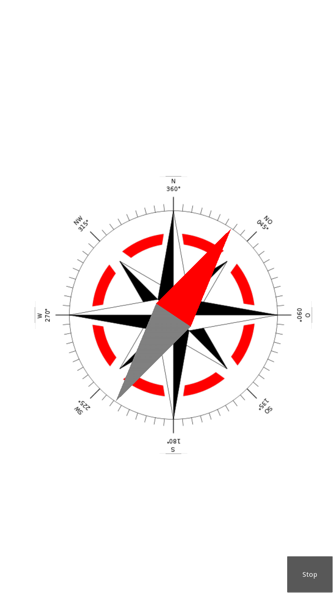

Compass
-------

The following example is an extract from the Compass app as provided in the Kivy
`examples/android/compass <https://github.com/kivy/kivy/tree/master/examples/android/compass/>`__
folder:

.. code-block:: python

   from jnius import autoclass

   ... 

   class CompassApp(App):

       def __init__(self, **kwargs):
           """
           Constructor of the Compass App

           1) The Java Android API DisplayMetrics is called to get
           information about the densityDpi factor of the Android device

           2) The Kivy Python-For-Android Android API is called to
           get access to the hardware sensors of the Android device

           """
           super(CompassApp, self).__init__(**kwargs)
           DisplayMetrics = autoclass('android.util.DisplayMetrics')
           metrics = DisplayMetrics()
           metrics.setToDefaults()
           LoggerDisplayMetrics(metrics)
           self.densityDpi = metrics.densityDpi

           Hardware = autoclass('org.renpy.android.Hardware')
           self.hw = Hardware()
           Logger.info('COMPASS: Hardware Objects: %s'%(str(dir(self.hw))))
           Logger.info('COMPASS: Hardware Sensors\n%s\n'%(self.hw.getHardwareSensors()))

       def viewCompass(self, *largs):
           """
           viewCompass calls the readSensor method of the 
           magneticFieldSensor instance of the generic3AxisSensor, it reads the
           3-tuple value of the magnetic field

           the declination angle is computed as the angle of the magnetic field 
           vector in the x,y-plane and the unity-vector of the y-axis.

           afterwards the rotateNeedle function rotates the needle as given
           by the declination angle parameter
           """ 
           (x, y, z) = self.hw.magneticFieldSensor.readSensor()
           declination = Vector(x,y).angle((0,1))
           Logger.info('COMPASS: viewCompass x=%s y=%s z=%s declination=%s'%(x,y,z,declination))
           self.needle.rotateNeedle(declination)

       def stopApp(self,*largs):
           """
           this function is called when pushed the stopButton, disables
           the magneticFieldSensor and stops the app
           """
           self.hw.magneticFieldSensor.changeStatus(False)
           Logger.info('COMPASS: stop largs '+str(largs))
           self.stop()

       def build(self):
           """
           Building all together:

           1) Creating the parent widget and clearing it to white background color

           2) Defining a suitable position and size of the CompassWidget, the 
              needleSize and the stopButtonHeight depending on the densityDpi value 
              given by DisplayMetrics 

           3) Creating an instance of the CompassWidget and adding it to the
              parent widget and calling the appropriate build function

           4) Creating an instance of the NeedleWidget and adding it also to the
              parent widget and calling the appropriate build function           

           5) Creating an instance of a Button widget and adding it as stopButton
              also to the parent widget and bind it with the stopApp function

           6) Calling the instance method changeStatus of the magneticFieldSensor
              instance with parameter True to enable the magnetic field sensor
              and additionally calling the function schedule_interval of the Clock
              class for a repeated call of the function viewCompass every second.
           """
           parent = FloatLayout(size=(500,500)) 
           Window.clearcolor = (1, 1, 1, 1)

           if self.densityDpi == 240:
               CompassPos = Vector(50., 200.)
               CompassSize = Vector(400., 400.)
               needleSize = Vector(100., 60.)
               stopButtonHeight = 60
           elif self.densityDpi == 320:
               CompassPos = Vector(75., 300.)
               CompassSize = Vector(600., 600.)
               needleSize = Vector(150., 90.)
               stopButtonHeight = 90
           else:
               Logger.info('COMPASS: widget size should be adopted - minimum used for densityDpi=%s'%(str(self.densityDpi)))
               CompassPos = Vector(50., 200.)
               CompassSize = Vector(400., 400.)
               needleSize = Vector(100., 60.)
               stopButtonHeight = 60

           self.Compass = CompassWidget()
           parent.add_widget(self.Compass)
           self.Compass.build(pos=CompassPos,size=CompassSize)

           self.needle = NeedleWidget()
           parent.add_widget(self.needle)
           self.needle.build(center=CompassPos+CompassSize/2.,needleSize=needleSize)

           self.stopButton = Button(text='Stop', pos_hint={'right':1}, size_hint=(None,None), height=stopButtonHeight)
           parent.add_widget(self.stopButton)
           self.stopButton.bind(on_press=self.stopApp)

           self.hw.magneticFieldSensor.changeStatus(True)
           Clock.schedule_interval(self.viewCompass, 1.)
           return parent

If you compile this app, you will get an APK which outputs the following
screen:

   Screenshot of the Kivy Compass App
   (Source of the Compass Windrose: `Wikipedia <http://en.wikipedia.org/wiki/Compass_rose>`__)

